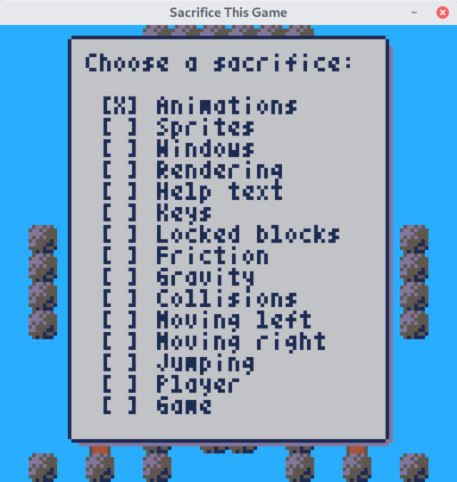

# Ludum Dare 43: Sacrifice This Game

Last week-end I participated in the [43rd Ludum Dare game jam](https://ldjam.com/).  Participants in the Ludum Dare "Compo" (one of the two competitions, which I took part in) have to make a game based on a given theme in 48 hours without using external assets or code besides libraries.

## My Game

The theme for this year was "Sacrifices must be made".  I quickly came up with three relatively bad ideas:

1. You are General Douglas Haig during the infamous battle of the Somme.  Your job is to send as many young Englishmen get murdered on the frontline as possible.
2. A Mayan sacrifice simulator, where you need to pry open someone's chest and recover their heart.
3. A platformer in which you need to give up one game feature at each level.

I decided to go for the third one because the other two were too gruesome, and I wasn't sure what to do with them anyway.

The final result is a game which I called "Sacrifice This Game".  You can find it [on the ldjam website](https://ldjam.com/events/ludum-dare/43/sacrifice-this-game).  It looks like this:

The game is a basic platformer.  You play with the directional arrows.  `Enter` selects an item in the menus.  `Tab` shows the pause menu.  The goal is to reach one of the doors.  Keys open locked blocks.  That's it.

Well, except that, when you enter a new level, you are faced with this screen:

Before continuing, you _have_ to sacrifice one feature of the game.  It can be anything, from animations, to moving left, to gravity.  Once a feature is sacrificed, it stays that way for the following levels.  If you are stuck, you need to go back and change the choices you made earlier.

## Technical Aspects

The game was made with Python and the [Pyxel retro game engine](https://github.com/kitao/pyxel).  In retrospect, I would've preferred to make the game in JavaScript, because Python is a pain to distribute.  However, using Pyxel was a great experience, and it allowed me to fast-prototype the game.  With another engine, I'm not sure I would've had time to finish it---especially in JS, which I don't know too well.

I am actually quite proud of the result!  I think it's the best game I made so far, though I would've enjoyed to spend more time polishing the level design and fixing the terrible hand-made collision system.  And cleaning the _awful_ code.  I'm thinking of porting it to JavaScript, in which case I would probably spend some time improving those aspects.

The source is available [on the Github repository](https://github.com/xlambein/ldjam43).  I would _not_ recommend looking at it, though.
