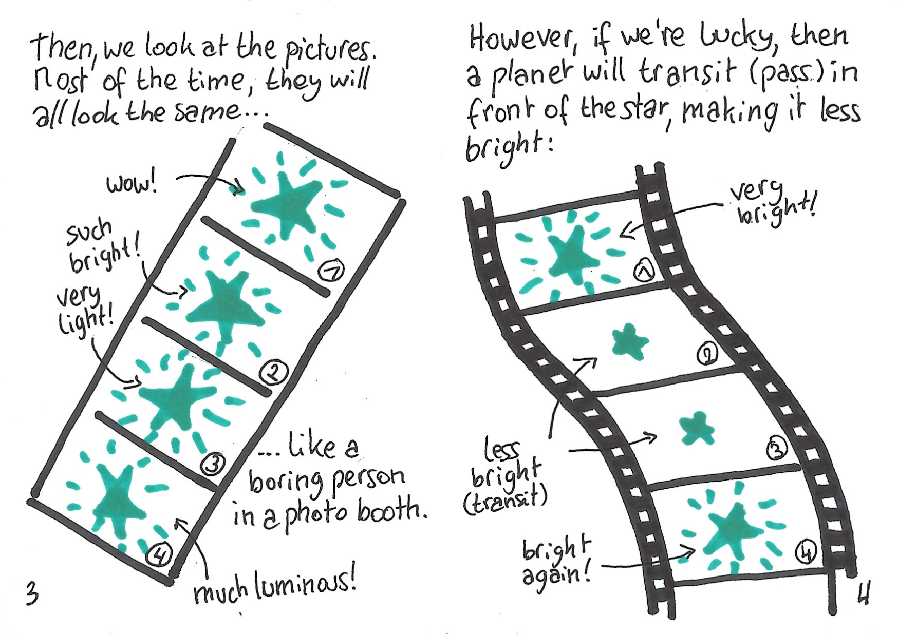

# Mini Sci-Zines

Inspired by [Malwine](http://malweene.com/) and [Éléonore Mayola](http://www.elle-est-au-nord.com/), I started a series of mini zines on exoplanets.  I had plans to make a few of those, but stopped after the second.  There's a third one sitting in a drawer, almost finished; I might come back to it someday.

Those zines are free to print & distribute.  Instructions on how to fold them (and also, how to make your own) [can be found here](http://www.rookiemag.com/2012/05/how-to-make-a-zine/).

## Sci-Zine #1: The Transit Method

[Click here to download the PDF and print it for yourself](transit/scizine001-transit.pdf), or read it below.

More info on the transit method can be found at the [Planetary Society](http://www.planetary.org/explore/space-topics/exoplanets/transit-photometry.html).

## Sci-Zine #2: The Radial Velocity Method

[Click here to download the PDF and print it for yourself](radial-velocity/scizine002-radial-velocity.pdf), or read it below.

More info on the radial velocity method can be found at the [Planetary Society](http://www.planetary.org/explore/space-topics/exoplanets/radial-velocity.html).
