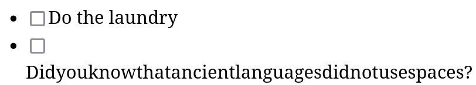

# Syntax errors for to-do lists

<script src="todo.js"></script>

I love syntax errors. The lil red squiggles in my text editor that let me know I forgot a semicolon. The obscure messages when the parser doesn't have a good error recovery mechanism. Syntax errors make me feel like a true programmer. None of this "structural editing" bullshit. No Scratch boxes. Not even parinfer. Learning to overcome the obtuseness of syntaxes and finding things like `foo::<T>()` beautiful is part of becoming a proper hacker.

Anyway, this begs the question: if syntax errors are so great, how can we bring them to other domains? Case in point: how do I introduce syntax errors to, say, [TodoMVC](https://todomvc.com/)?

## Syntaxes

Well in order to get syntax errors, first we need _syntax_. A simple way to do that is to take what I call the "terminal" route, and simply forgo the very concept of graphical user interface. If you pretend everything is a piece of text and can be interacted with through a buffer, turns out you can get very far in terms of brutalist UI. Your to-do list app becomes something like this:

```
# Day plan

[ ] Do the laundry
[x] Buy groceries
[ ] Write a stupid blog post about syntax errors in to-do lists
[ ] Call my parents
```

And then you get to enjoy the fun of syntax errors, for example by writing `Call my parents [x]` or `[[] Do the laundry`. Beautiful.

By the way, if you want fancy-ass features such as "pressing a button to add a task" or "filtering tasks by status", you can implement them as, I don't know, an Emacs major mode or a language server. Have fun.

I for one like GUIs, and so I'd prefer to keep my little checkboxes and variable-width fonts. So I'll ask myself: what's the syntax of a GUI to-do app? Does that question even make sense?

Well I'd argue that there _is_ a syntax to a to-do list app, but it's not for a parser: it's for the user. It's the syntax that says "a to-do list is a list of tasks" and "each task has a checkbox on the left and a description", and "a checkbox can be ticked or not". If the UI designer breaks this syntax, for example by removing the checkbox of a task, the user will perceive this as a "syntax error". Note that users are intelligent and so they might be able to work with mild syntax errors that would confuse most parsers---for example, if the layouting engine has a breakdown and puts the checkbox above the text rather than to its left.



## A graphical grammar

Speaking of parsers: can we transform this "user syntax" for a to-do list into a "parser syntax" that a program could execute? Again: we aren't interested in text-based "interfaces". Instead, let's define a sort of "graphical grammar".

First we'll need some general principles. Skip those if you're too cool for boring lists.

- Widgets are things like text and checkboxes on a 2D plane. They have a position and size.
- Widgets can be put together in (potentially nested) groups, which have the position and size of their bounding box.
- We use "item" as meaning both widgets and groups.
- The grammar is a set of rules describing how items are grouped together into new groups.
- The rules of the grammar group items according to their relative positions. If there are multiple candidates, the closest one is picked.
- Each item must be part of exactly one group, except for the "universe" item which describes the whole thing we're trying to parse.
- The grammar is provided "as is", without warranty of any kind, express or implied. In no event shall the author of this blog post be liable for any claim, psychic damage or other liability arising from the subject of this post.

Now for our actual rules:

- The universe is a _to-do list_.
- A _to-do list_ is a _title_ and a _list of tasks_ below it.
- A _title_ is a piece of text in large font size.
- A _list of tasks_ is zero or more _tasks_, arranged vertically.
- A _task_ is a checkbox and a _description_ to its right.
- A _description_ is a piece of text in regular font size.

## Demo

Based on the aforementioned rules, I've implemented a prototype of our improved to-do list web app, which you can try out below.

<div style="text-align: center; padding: 5px;">
  <button onclick="addCheckboxElement()">Add Checkbox</button>
  <button onclick="addTextElement('16px')">Add Text</button>
  <button onclick="addTextElement('24px')" style="font-size: 24px;">Add Large Text</button>
</div>

<div id="universe"></div>

If for some reason this doesn't work on your device, or you lack the hacker grit needed to roll your own to-do list with this tool, here's a little video I made:


## Okay but why

I'm not sure yet.

<style>
  .widget {
    position: absolute;
    cursor: grab;
    padding: 5px;
  }

  .widget:hover {
    border: 1px solid #ccc;
    padding: 4.5px;
    background-color: #f9f9f9;
  }

  .checked {
    text-decoration: line-through;
    color: #888;
  }

  #universe {
    position: relative;
    border: 1px solid #ccc;
    height: 400px;
    width: 100%;
    padding: 2px;
  }

  [data-error]::after {
    content: attr(data-error);
    font-size: 0.8em;
    background-color: white;
    opacity: 0.9;
    padding: 5px;
    border: 2px dashed red;
    z-index: 1;
  }

  #universe[data-error]::after {
    position: absolute;
    right: 0;
    top: 0;
  }

  .widget[data-error]::after {
    position: absolute;
    left: 0;
    top: 100%;
    min-width: 100px;
  }
</style>
